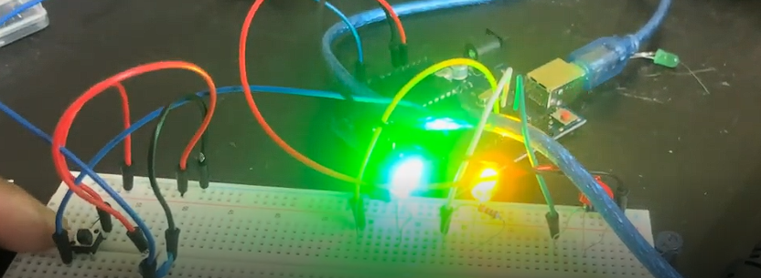

# Debouncing Electrical Signals

Whenever a button is pressed, the button can bounce due to vibrations because of extra kinetic energy, which gets turned into electrical noise, which is AKA a switch bounce.

This code ensures that the noise is not detected hence we "debounced" the button. It does this by checking the duration since the last detected button state change, if this is at least 50ms, then it checks the button state change, stores the new value inside buttonState then runs the toggleLED() function.

## Video Demonstration

Click the thumbnail below:

